# AAURA — Architecture Diagrams

Visual reference for the AAURA campus platform (Flutter + Express + Supabase + FastAPI AI).

> **Viewing:** Open this file in GitHub, VS Code, or any Mermaid-compatible viewer. Diagrams render from fenced `mermaid` blocks.

---

## Table of contents

1. [External entities (context diagram)](#1-external-entities-context-diagram)
2. [Deployment diagram](#2-deployment-diagram)
3. [Subsystems & internal services](#3-subsystems--internal-services)
4. [Entity–relationship diagram (ERD)](#4-entityrelationship-diagram-erd)
5. [Class diagram](#5-class-diagram)
6. [Use case diagram](#6-use-case-diagram)
7. [State machine diagrams](#7-state-machine-diagrams)

---

## 1. External entities (context diagram)

High-level view of AAURA and external actors/systems.

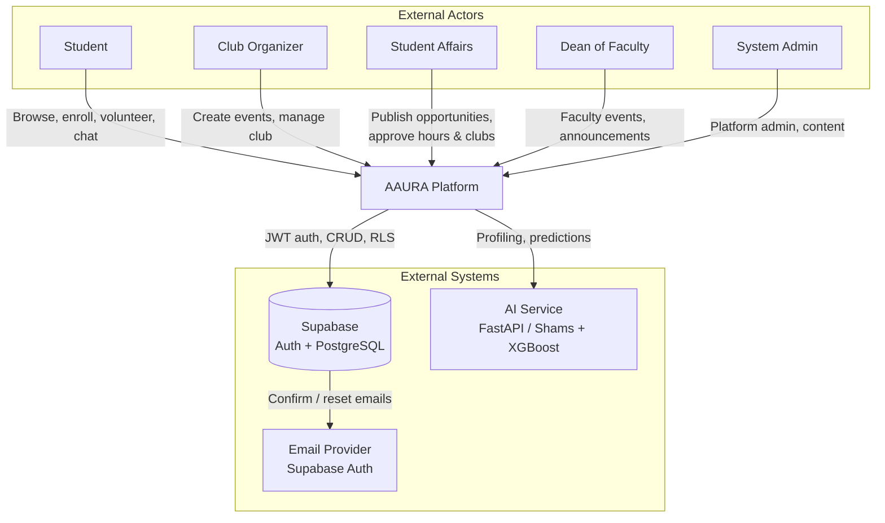

---

## 2. Deployment diagram

Production topology (see `docs/DEPLOY.md`).

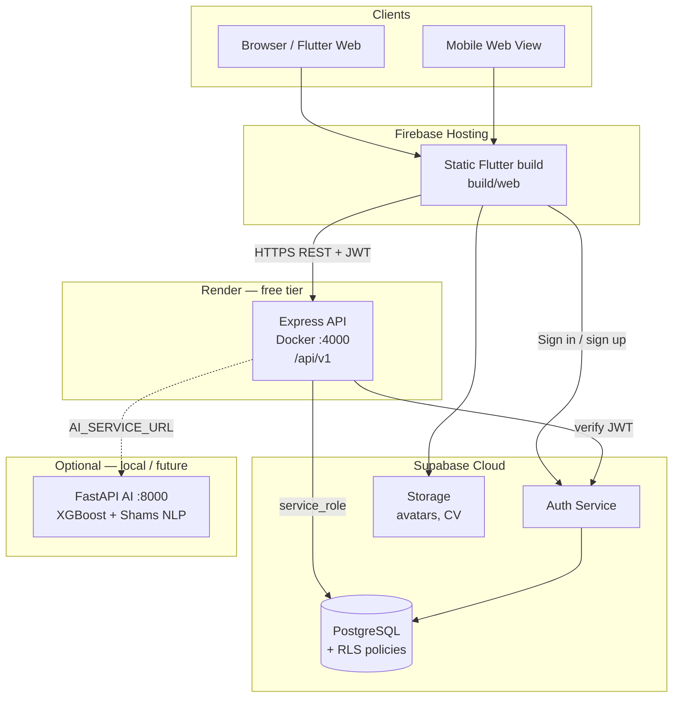

| Node | Technology | Role |
|------|------------|------|
| Flutter Web | Firebase Hosting | UI, QR scan, role-based shells |
| Express API | Render (Docker) | Business logic, authorization |
| PostgreSQL | Supabase | Persistent data, migrations |
| Auth | Supabase | Campus email login, JWT |
| AI | FastAPI (optional) | Event success prediction, Shams profiling |

---

## 3. Subsystems & internal services

Logical decomposition of the backend API and client.

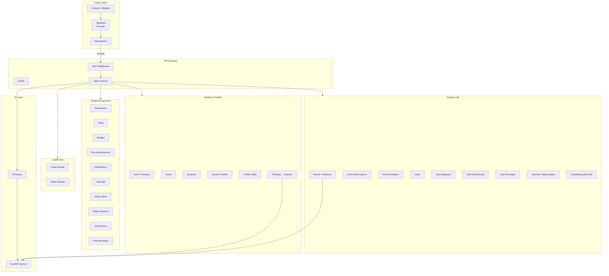

### Backend module map

| Prefix | Module | Primary tables |
|--------|--------|----------------|
| `/auth` | Provision campus users | `users`, `students` |
| `/events` | CRUD + review workflow | `events` |
| `/event-reservations` | Reserve, join QR, check-in | `event_reservation` |
| `/clubs`, `/club-membership` | Clubs & rosters | `clubs`, `club_membership` |
| `/club-requests` | Founding approval | `club_requests` |
| `/volunteering` | Hour submissions & approval | `volunteering_records` |
| `/volunteering-opportunities` | Publish + QR join | `volunteering_opportunities` |
| `/profiling` | Shams onboarding | `student_profiles`, drafts |
| `/gamification`, `/shop`, `/badges` | Points economy | `gamification`, `shop_*` |
| `/dean`, `/admin` | Role dashboards | various |

---

## 4. Entity–relationship diagram (ERD)

Core schema (PostgreSQL / Supabase). Cardinality: `||` one, `o{` many.

```mermaid
erDiagram
    users ||--o| students : "has"
    users ||--o| student_profiles : "has"
    users ||--o| student_profile_drafts : "has"
    users ||--o| gamification : "has"
    users ||--o{ events : "organizes"
    users ||--o{ event_reservation : "reserves"
    users ||--o{ event_feedback : "rates"
    users ||--o{ club_membership : "joins"
    users ||--o{ volunteering_records : "submits"
    users ||--o{ volunteering_opportunities : "creates"
    users ||--o{ club_requests : "requests"
    users ||--o{ notifications : "receives"
    users ||--o{ study_plans : "owns"
    users ||--o{ calendar : "owns"
    users ||--o{ peer_connections : "connects"
    users ||--o{ shop_purchases : "buys"

    events ||--o{ event_reservation : "has"
    events ||--o{ event_feedback : "has"
    events ||--o| volunteering_opportunities : "linked"

    clubs ||--o{ club_membership : "has"
    clubs ||--o{ club_messages : "has"
    clubs ||--o{ club_activity_posts : "has"
    club_requests }o--o| clubs : "creates"

    volunteering_opportunities ||--o{ volunteering_records : "applications"

    study_sessions ||--o{ study_session_membership : "has"

    shop_items ||--o{ shop_purchases : "sold"

    users {
        uuid id PK
        text email UK
        text full_name
        app_role role
        boolean is_suspended
    }

    students {
        uuid id PK
        uuid user_id FK UK
        text university_id UK
        text major
        int academic_year
    }

    student_profiles {
        uuid id PK
        uuid user_id FK UK
        jsonb interests
        jsonb strengths
        jsonb goals
    }

    events {
        uuid id PK
        uuid organizer_id FK
        text title
        timestamptz starts_at
        text status
        boolean is_approved
        boolean is_hidden
        uuid join_token UK
        numeric ai_success_score
    }

    event_reservation {
        uuid id PK
        uuid event_id FK
        uuid user_id FK
        text reservation_status
        uuid qr_token UK
    }

    clubs {
        uuid id PK
        text name UK
        uuid organizer_id FK
        boolean is_active
        boolean is_hidden
    }

    club_requests {
        uuid id PK
        uuid requester_id FK
        text proposed_name
        text status
        uuid created_club_id FK
    }

    volunteering_opportunities {
        uuid id PK
        uuid created_by FK
        uuid event_id FK
        uuid join_token UK
        text status
        numeric estimated_hours
    }

    volunteering_records {
        uuid id PK
        uuid user_id FK
        uuid opportunity_id FK
        numeric hours
        text status
        uuid approved_by_staff_id FK
    }

    gamification {
        uuid id PK
        uuid user_id FK UK
        int points
        jsonb badges
    }
```

### Supporting entities (abbreviated)

| Table | Relates to |
|-------|------------|
| `recommendations` | `users` → events/clubs/study/volunteer targets |
| `notifications` | `users` (inbox) |
| `calendar` | `users` (study/reminder/event items) |
| `study_plans` | `users` |
| `study_sessions` / `study_session_membership` | host + attendees |
| `peer_direct_messages` | student messaging |
| `shop_items` / `shop_purchases` | gamification economy |
| `badge_definitions` | catalog; earned IDs in `gamification.badges` |
| `faculty_announcements` | dean broadcasts |
| `platform_settings` | admin configuration |

---

## 5. Class diagram

Simplified application-layer classes (Flutter domain + backend services).

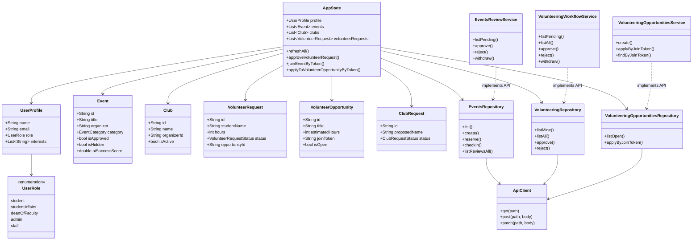

---

## 6. Use case diagram

Actors and major use cases by role.

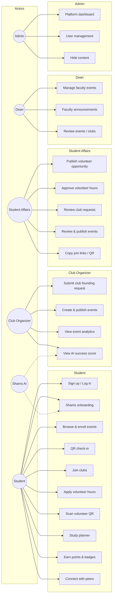

---

## 7. State machine diagrams

### 7.1 Event lifecycle

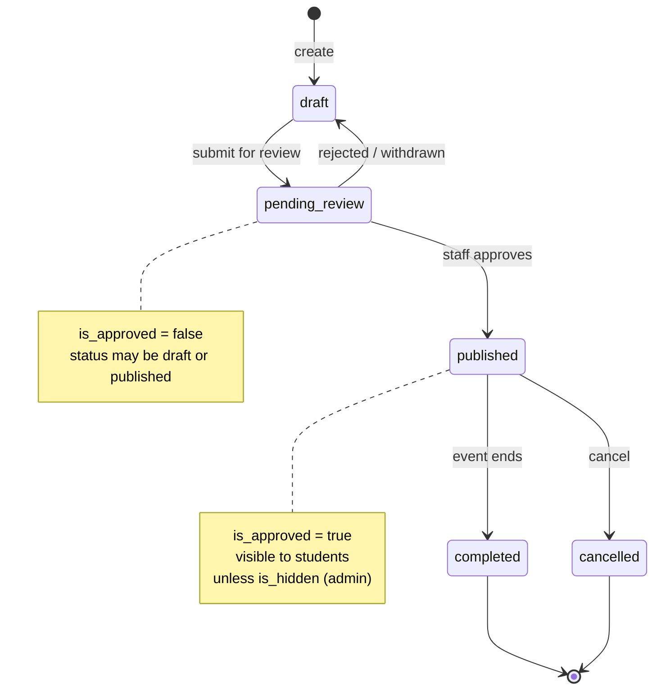

### 7.2 Event reservation

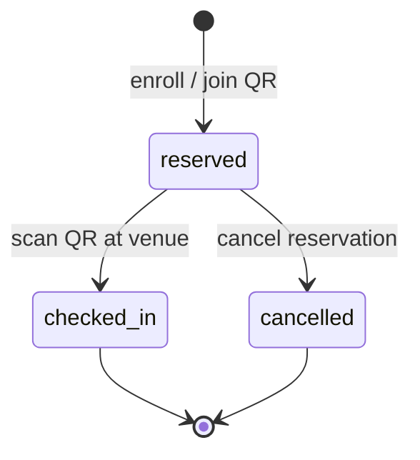

### 7.3 Volunteer hour record

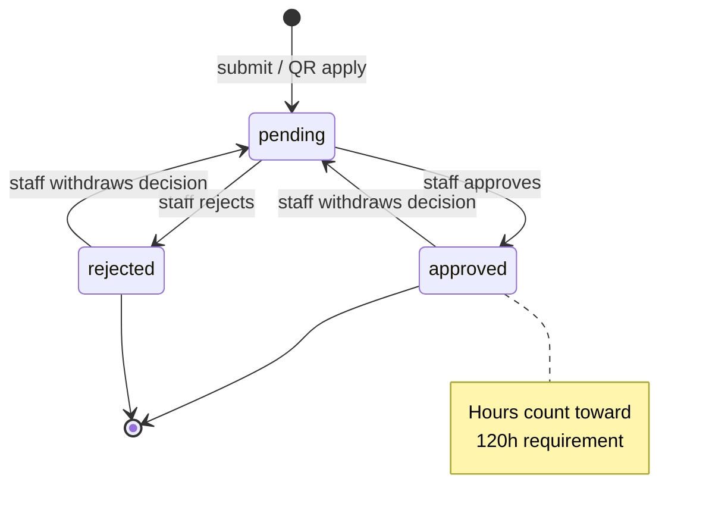

### 7.4 Volunteer opportunity

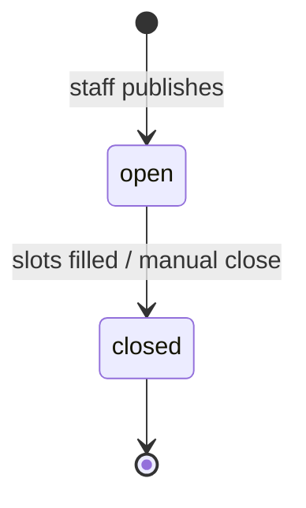

### 7.5 Club founding request

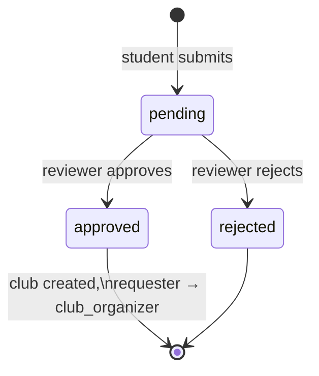

### 7.6 Authentication & onboarding (student)

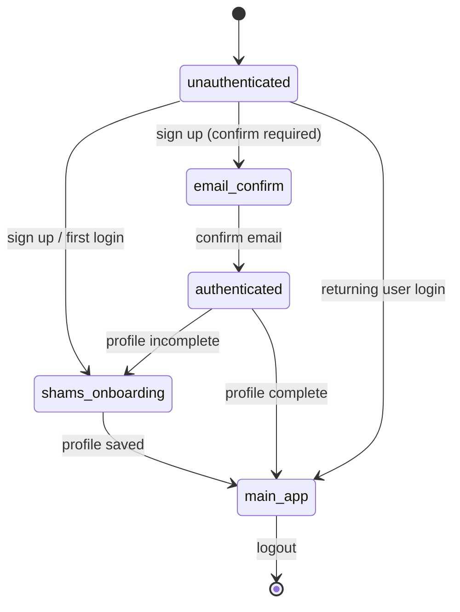

---

## Diagram sources

| Diagram | Primary sources |
|---------|-----------------|
| ERD | `backend/supabase/migrations/*.sql` |
| Class | `flutter-app/lib/models/`, `lib/state/app_state.dart`, `backend/src/modules/` |
| Use cases | Role gates in `app_state.dart`, route authorization |
| State machines | `events`, `volunteering_records`, `club_requests`, `event_reservation` constraints |
| Deployment | `docs/DEPLOY.md`, `render.yaml`, `flutter-app/scripts/build-web-release.ps1` |
| Context / services | `backend/src/routes/index.ts`, `ai/main.py` |

---

*Generated for AAURA — Arab American University campus platform.*
