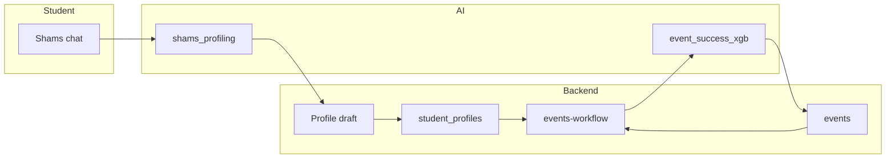
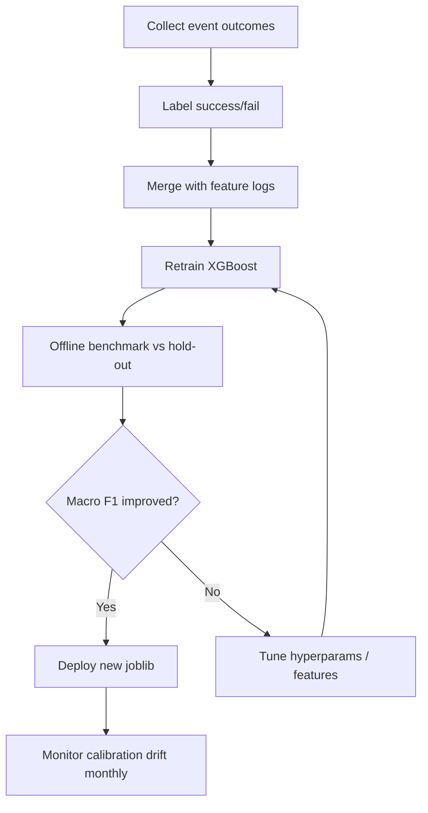

# AAURA Intelligent Models — Managerial Insights & Academic Reference

This document describes the **decision-support models** embedded in AAURA: the **XGBoost event-success classifier** (primary supervised ML component) and the **Shams student-profiling pipeline** (NLP-based, rule-augmented). It is written for two audiences: campus leadership evaluating ROI and risk, and academic reviewers assessing methodology and validity.

---

## Part A — Managerial insights

### A.1 What problem the models solve

Campus teams publish many events, clubs, and programs, but attendance and engagement are uneven. AAURA addresses this in two linked ways:

| Capability | Business question | Who benefits |
|------------|-------------------|--------------|
| **Event success prediction (XGBoost)** | *Before we publish, how likely is this event to succeed with our current audience?* | Student Affairs, club organizers, faculty event leads |
| **Shams profiling (NLP)** | *Who is this student, what do they care about, and what strengths can we build on?* | Students (onboarding), personalization, event targeting inputs |

Together, they support **evidence-informed programming**: fewer low-fit events, clearer targeting, and profiles that feed match scores used at prediction time.

### A.2 Value proposition (non-technical)

1. **Earlier feedback** — Organizers see a success probability and engagement score while drafting an event, not only after poor turnout.
2. **Audience alignment** — Scores incorporate interest/skill overlap between event copy and enrolled (or targeted) students, derived from Shams-built profiles.
3. **Operational efficiency** — Staff can prioritize promotion, capacity, or schedule changes on events flagged below threshold before launch.
4. **Student experience** — Onboarding via conversational Shams reduces form friction and produces structured interests/strengths for recommendations and event discovery.

### A.3 How it appears in the product

- **Student Affairs / organizers**: Create or open an event → AI card shows **success %**, **engagement score**, and feature context (enrollment count, interest match). Draft events can call `predict-draft` before publish.
- **Students**: Shams chat during signup or profile update → traits, interests, and summary stored → used for goals, skill progress, and event matching.
- **Fallback behavior**: If the AI service or model file is unavailable, the app surfaces an error or degraded preview rather than silently inventing scores (see test case ML-04 in `docs/TEST_CASES.md`).

### A.4 Key performance indicators (suggested for governance)

| KPI | Definition | Target direction |
|-----|------------|------------------|
| **Prediction coverage** | % of published events with a stored `ai_success_score` | ↑ toward 100% for Affairs-created events |
| **Calibration drift** | Gap between predicted success rate and actual check-in / attendance | ↓ over time |
| **Profile completion** | % of new students with confirmed Shams profile | ↑ |
| **Time-to-first-event** | Days from signup to first event reservation | ↓ (personalization quality) |
| **Staff rework rate** | Events edited or cancelled after low AI preview | Track; high rate may mean threshold tuning or training data gap |

### A.5 Risks and mitigations (management view)

| Risk | Impact | Mitigation in AAURA |
|------|--------|---------------------|
| **Synthetic training data** | Model accuracy on paper may not transfer to real campus data | Treat scores as *decision support*, not guarantees; plan retraining on historical attendance |
| **Threshold rigidity (0.5)** | Borderline events flip label with small probability changes | UI uses bands (High ≥75%, Medium ≥50%); managers can override human judgment |
| **Profile sparsity** | New students with empty profiles yield weak match scores | Shams onboarding + manual profile fields; scores improve as enrollments grow |
| **Over-reliance on automation** | Staff might defer to AI instead of domain knowledge | Position model as advisory; retain publish authority with Affairs |
| **Fairness / representation** | Majors or interests underrepresented in training lexicon | Monitor outcomes by major/department; expand lexicon and real labels |
| **Privacy** | Profiling infers traits from free text | Student-owned draft → explicit confirm; RBAC limits profiling to students |

### A.6 Deployment and ownership

| Layer | Artifact | Owner action |
|-------|----------|--------------|
| AI service | `ai/app/ml/models/event_success_xgb.joblib` | Run `npm run train:ai` once per environment (or after retraining) |
| AI service | FastAPI on port 8000 | Health: `GET /api/health` |
| Backend | Proxies predictions via `/api/predictions/event-success` | Requires AI service up for live scores |
| Data | Shams drafts → `student_profiles` on confirm | Backend + Supabase |

**Recommendation for production**: Assign **Student Affairs + IT** joint ownership—Affairs validates interpretability of scores; IT owns retraining cadence and monitoring.

### A.7 Roadmap talking points (for stakeholders)

1. **Phase 1 (current)** — Synthetic-trained XGBoost + rule-based Shams; live features from enrollments and profiles.
2. **Phase 2** — Retrain on **real event outcomes** (reservations, check-ins, feedback ratings).
3. **Phase 3** — Recommendation engine upgrade from rule-based to collaborative / content-based ML using the same profile features.
4. **Phase 4** — Explainability dashboard (feature importance, SHAP) for accreditation and student transparency.

---

## Part B — Academic reference (event success model)

### B.1 Problem formulation

**Task**: Binary classification — predict whether a campus event will be **high success** (`success = 1`) vs **low success** (`success = 0`).

**Operational definition of success (training label)**: Generated synthetically from a latent success probability function plus label noise (~6% flip rate). In deployment, the model outputs:

- `success_probability` ∈ [0, 1] — estimated P(high success)
- `success_label` ∈ {0, 1} — `1` if probability ≥ **0.5**
- `engagement_score` ∈ [0, 100] — composite display metric (see B.6)

This is a **supervised classification** problem with mixed categorical and numeric features.

### B.2 Algorithm

**Model**: **XGBoost** (`XGBClassifier` — gradient boosted decision trees).

**Hyperparameters** (from `ai/app/ml/train_event_success.py`):

| Parameter | Value |
|-----------|-------|
| `n_estimators` | 220 |
| `max_depth` | 5 |
| `learning_rate` | 0.06 |
| `min_child_weight` | 2 |
| `subsample` | 0.88 |
| `colsample_bytree` | 0.88 |
| `reg_lambda` | 1.2 |
| `eval_metric` | logloss |
| `random_state` | 42 |

**Rationale**: Boosted trees handle nonlinear interactions (e.g., workshop × CS major × high interest match) without explicit feature crosses; regularization reduces overfitting on moderate-sized tabular data.

### B.3 Feature set

Defined in `ai/app/ml/features.py`:

**Categorical (label-encoded, unknown → `__UNK__`)**

| Feature | Description |
|---------|-------------|
| `student_major` | Dominant major among enrollees (or organizer major if none) |
| `event_type` | Inferred category: workshop, seminar, social, career, sports, volunteer, hackathon, cultural |
| `department` | Hosting / dominant department |
| `organizer_type` | `club_student`, `club_event`, `student_affairs`, `dean_of_faculty` |

**Numeric**

| Feature | Description |
|---------|-------------|
| `expected_attendance` | Reservation count (live) or capacity-based estimate (draft) |
| `interest_match_score` | [0, 1] overlap between student interests/tags and event text |
| `skill_match_score` | [0, 1] overlap between student strengths/skills and event text |
| `target_major_count` | Number of explicit target majors on the event |
| `target_interest_count` | Number of explicit target interests on the event |

**Target**: `success` (binary).

At inference, the backend assembles features from Supabase (`events`, `students`, `student_profiles`, reservations) before calling the AI service (`backend/src/modules/events/services/events-workflow.service.ts`).

### B.4 Training data

| Property | Value |
|----------|-------|
| Source | **Synthetic** — `ai/app/ml/generate_dataset.py` |
| Default size | **2,400 rows** |
| Label mechanism | Latent logistic-style function of features + **6% random label noise** |
| Split | 80% train / 20% test, stratified, `random_state=42` |
| Cross-validation | **5-fold CV** on full dataset, accuracy metric |

The generative process encodes domain hypotheses: higher success when interest/skill match is high, department aligns with major, attendance is sufficient, and organizer type is club or affairs-led.

**Academic caveat**: Reported accuracy reflects **recoverability of the synthetic generative rule**, not yet empirical campus validity. For thesis or accreditation, label this as **proof-of-concept** and specify a validation plan on real outcomes.

### B.5 Reported evaluation metrics

From the training pipeline (typical run after `py -m app.ml.train_event_success`):

| Metric | Typical value | Notes |
|--------|---------------|-------|
| **5-fold CV accuracy** | ~**0.902** (± std across folds) | Stored in model bundle as `cv_accuracy` |
| **Hold-out test accuracy** | ~**0.892** | Stored as `training_accuracy` |
| **Classification threshold** | **0.5** on P(success) | `success_label = 1 if proba ≥ 0.5 else 0` |

The training script prints a full **sklearn classification report** (precision/recall/F1 per class: `low_success`, `high_success`).

**Suggested additional metrics for academic rigor** (not yet automated in repo):

- ROC-AUC and PR-AUC (class imbalance sensitivity)
- Brier score (probability calibration)
- Confusion matrix on **real** post-event labels
- Subgroup metrics by major and event type (fairness)

### B.6 Engagement score (derived metric)

Not a separate trained model. Computed at inference:

```
engagement_score = min(100, proba × 55 + interest_match × 25 + skill_match × 20)
```

Weights emphasize model probability (55%), then interest alignment (25%), then skill alignment (20%). Stored on the event as `ai_engagement_score` alongside `ai_success_score` (= probability × 100).

### B.7 Inference pipeline

```
Flutter (organizer UI)
  → Backend events-workflow (feature engineering)
    → AI POST /api/predictions/event-success
      → EventSuccessModel.predict()
        → LabelEncoder + XGBoost predict_proba
  → Scores persisted on events row
```

Model artifact: `ai/app/ml/models/event_success_xgb.joblib` (joblib bundle: model, encoders, column lists, CV accuracy).

### B.8 Shams profiling pipeline (complementary, non-XGBoost)

**Type**: **Rule-based NLP** with optional NLTK tokenization/lemmatization — not a trained neural or statistical classifier.

**Steps** (`ai/app/services/shams_profiling.py`):

1. Tokenize, stopword removal, lemmatization  
2. Trait detection via regex patterns (leadership, technical, community, etc.)  
3. Interest mapping via controlled lexicon aligned to Flutter UI categories  
4. Keyword extraction (unigrams + repeated bigrams)  
5. Template-based summary + heuristic confidence:  
   `confidence = min(0.95, 0.40 + 0.08×|traits| + 0.05×|interests| + 0.015×|keywords|)`

**Academic classification**: Knowledge-based information extraction / shallow NLP. Suitable to cite as **expert-system-style profiling** feeding downstream tabular features (`interest_match_score`, `skill_match_score`) for XGBoost.

**Limitations**: English-centric; regex bias; no inter-annotator agreement study; confidence is heuristic, not calibrated probability.

### B.9 System integration diagram



### B.10 Ethical and responsible use (for IRB / accreditation)

1. **Transparency** — Students should know Shams builds a profile used for recommendations and event matching; confirm step is explicit.
2. **Human override** — Publish and approval workflows remain with authorized staff, not the model.
3. **No high-stakes automated decisions** — Scores advise scheduling/promotion; they do not affect grades, discipline, or admission.
4. **Data minimization** — Profiling stores extracted traits/interests, not raw chat indefinitely (draft cleared on confirm).
5. **Bias auditing** — Required before claiming equity benefits; synthetic training may not represent all majors equally.

### B.11 Reproducibility checklist

| Step | Command / path |
|------|------------------|
| Generate data | `py -m app.ml.generate_dataset` |
| Train model | `py -m app.ml.train_event_success` or `npm run train:ai` |
| Verify artifact | `ai/app/ml/models/event_success_xgb.joblib` |
| Smoke predict | `POST /api/predictions/event-success` with JSON body per `EventSuccessPredictRequest` |
| End-to-end | Create event as Affairs → Refresh AI card in Flutter (see `flutter-app/README.md`) |

### B.12 Suggested citations and related work (for papers/theses)

When writing academically, position AAURA relative to:

- **Learning analytics** — Predicting student engagement from behavioral and profile data  
- **Gradient boosting for tabular prediction** — Chen & Guestrin, XGBoost (2016)  
- **Campus event recommendation** — Content-based matching using interests/skills  
- **Conversational onboarding** — Structured extraction from natural language vs traditional forms  

Example framing sentence:

> *We implement a two-stage campus intelligence stack: a lexicon-driven profiling module converts unstructured student input into structured interests and strengths, and an XGBoost classifier estimates event success probability from audience–event alignment features, with decision support surfaced to organizers prior to publication.*

---

## Part C — Quick reference tables

### C.1 Model comparison

| Aspect | Event success (XGBoost) | Shams profiling |
|--------|-------------------------|-----------------|
| Learning | Supervised (boosted trees) | Rule-based + lexicon |
| Training data | 2,400 synthetic rows | None (hand-crafted patterns) |
| Output | Probability, label, engagement | Traits, interests, summary, confidence |
| Primary user | Organizers / Affairs | Students |
| Validation status | CV ~90% on synthetic data | Qualitative / UX validation needed |

### C.2 Files to cite in documentation or appendix

| File | Role |
|------|------|
| `ai/app/ml/train_event_success.py` | Training script |
| `ai/app/ml/generate_dataset.py` | Synthetic label generation |
| `ai/app/ml/features.py` | Feature schema |
| `ai/app/ml/event_success_model.py` | Inference + threshold 0.5 |
| `ai/app/services/shams_profiling.py` | NLP profiling |
| `backend/src/modules/events/services/events-workflow.service.ts` | Live feature assembly |
| `docs/TEST_CASES.md` §10 | QA cases ML-01–ML-05 |

---

## Part D — Benchmarks, AI parameters & fine-tuning

### D.1 Benchmark results (event success model)

**Run command**: `npm run train:ai` (or `py -m app.ml.train_event_success` from `ai/`)

**Environment**: AAURA repo, synthetic dataset (2,400 rows), stratified 80/20 split, `random_state=42`.

#### D.1.1 Primary metrics (latest training run)

| Metric | Value | Interpretation |
|--------|-------|----------------|
| **5-fold CV accuracy** | **0.902** (± **0.005**) | Mean accuracy across folds; stored as `cv_accuracy` in `.joblib` |
| **Hold-out test accuracy** | **0.892** | 480 test rows (20% of 2,400) |
| **Macro F1** | **0.73** | Balanced across both classes |
| **Weighted F1** | **0.88** | Dominated by majority class |

#### D.1.2 Per-class breakdown (test set, n=480)

| Class | Support | Precision | Recall | F1 |
|-------|---------|-----------|--------|-----|
| `low_success` | 66 | 0.66 | 0.44 | 0.53 |
| `high_success` | 414 | 0.92 | 0.96 | 0.94 |

**Class imbalance**: ~86% high-success labels in the test split. High overall accuracy partly reflects majority-class performance; **low-success recall (0.44)** is the main weakness — the model misses many low-success cases.

#### D.1.3 Benchmark protocol (for academic reporting)

| Setting | Value |
|---------|-------|
| Data | `ai/app/ml/data/event_success_training.csv` |
| CV | 5-fold, metric = accuracy |
| Test split | 20%, stratified |
| Label noise (synthetic) | 6% random flip |
| Decision threshold | 0.5 on `predict_proba[:, 1]` |
| Artifact | `ai/app/ml/models/event_success_xgb.joblib` |

#### D.1.4 Recommended production benchmarks (not yet implemented)

Track these once real event outcomes exist:

| Benchmark | Definition | Target |
|-----------|------------|--------|
| **Real-world accuracy** | Predicted label vs actual (check-in rate ≥ X% or feedback ≥ 4★) | Report annually |
| **ROC-AUC** | Ranking quality across thresholds | ≥ 0.85 |
| **Calibration (Brier)** | \|mean predicted prob − observed success rate\| | < 0.10 |
| **Low-success recall** | Catch weak events before publish | > 0.60 |
| **Latency p95** | `POST /api/predictions/event-success` | < 200 ms |

#### D.1.5 Shams profiling (qualitative benchmark)

No numeric ML benchmark is automated. Suggested evaluation:

| Check | Method |
|-------|--------|
| Interest precision | Manual review of 50 chat transcripts vs extracted interests |
| Trait coverage | % messages with ≥1 trait detected |
| Confidence calibration | Compare Shams confidence to user “Keep” vs “Regenerate” rate |

---

### D.2 AI parameters reference (all tunables)

#### D.2.1 XGBoost classifier (`train_event_success.py`)

| Parameter | Current | Role | Fine-tune range (suggested) |
|-----------|---------|------|----------------------------|
| `n_estimators` | 220 | Number of boosting rounds | 100–400 |
| `max_depth` | 5 | Tree depth / interaction order | 3–8 |
| `learning_rate` | 0.06 | Step size per tree | 0.03–0.12 |
| `min_child_weight` | 2 | Min sum of instance weight in child | 1–5 |
| `subsample` | 0.88 | Row subsample per tree | 0.7–1.0 |
| `colsample_bytree` | 0.88 | Column subsample per tree | 0.7–1.0 |
| `reg_lambda` | 1.2 | L2 regularization | 0.5–2.0 |
| `eval_metric` | logloss | Training loss | logloss / auc |
| `random_state` | 42 | Reproducibility | fixed for reports |

**Not set (XGBoost defaults apply)**: `scale_pos_weight`, `gamma`, `max_delta_step` — consider `scale_pos_weight` if low-success recall stays low on real data.

#### D.2.2 Inference & display thresholds

| Parameter | Value | Location | Effect |
|-----------|-------|----------|--------|
| **Success label threshold** | **0.5** | `event_success_model.py` L50 | Binary high/low success |
| **UI band — High** | **≥ 75%** (`ai_success_score` or `successProb ≥ 0.75`) | `predictions_repository.dart` | Green / “Strong signal” copy |
| **UI band — Medium** | **≥ 50%** | same | Amber / moderate confidence |
| **UI band — Early signal** | **< 50%** | same | Low confidence messaging |
| **Engagement weights** | proba×**55** + interest×**25** + skill×**20** | `event_success_model.py` L54 | 0–100 engagement score |
| **Draft recommendation cutoff** | successProb **< 0.55** | `predictions_repository.dart` | “Narrow audience or boost promotion” |
| **Engagement tip cutoff** | engagement **< 0.5** (raw 0–100 scale in API) | same | “Align title/tags…” |

#### D.2.3 Synthetic data generator (`generate_dataset.py`)

| Parameter | Value | Effect |
|-----------|-------|--------|
| `ROWS` | 2400 | Training set size |
| `random.seed` | 42 | Reproducibility |
| Label noise rate | **6%** | `_noisy_label()` flip probability |
| Label cutoff | **0.5** | Latent probability → binary label |
| Base probability | 0.18 | Starting P(success) before feature terms |
| Interest weight | **+0.34** × interest_match | Dominant positive signal |
| Skill weight | **+0.22** × skill_match | Second positive signal |
| Attendance term | min(attendance,300)/700 | Scale with expected size |
| Low attendance penalty | −0.08 if attendance < 25 | |
| Low interest penalty | −0.12 if interest_match < 0.35 | |
| Low skill penalty | −0.08 if skill_match < 0.3 | |

Retraining on **real** data should replace or blend this generator — do not only tune XGBoost on synthetic rules indefinitely.

#### D.2.4 Backend feature engineering (`event-ml-features.ts`)

| Parameter | Value | Effect |
|-----------|-------|--------|
| Empty list match default | **0.2** | Draft / no-target interest & skill baseline |
| Enrollee empty match | **0.2** interest, **0.2** skill | No reservations yet |
| Per-student interest default | **0.25** | When profile lists are sparse |
| Draft expected attendance | `capacity × (0.35 + promotion × 0.08)` | promotion clamped 1–5 |
| Token match min length | **4** chars | Substring hit in event text |

#### D.2.5 Shams NLP (`shams_profiling.py`)

| Parameter | Value | Effect |
|-----------|-------|--------|
| Confidence base | **0.40** | Minimum confidence floor |
| Per trait | **+0.08** | Each detected trait |
| Per interest | **+0.05** | Each mapped interest |
| Per keyword | **+0.015** | Each salient keyword |
| Confidence cap | **0.95** | Maximum confidence |
| Lexicon interest hit (lemma) | **+2** score | Strong match |
| Lexicon interest hit (substring) | **+1** score | Weak match |
| Max keywords | **8** | Keyword list length |
| Default trait if none | `exploratory` | Fallback trait |

**Trait patterns**: 10 regex rules (`leadership`, `technical`, `community`, …) — edit `TRAIT_PATTERNS`.

**Interest lexicon**: 12 categories × word lists — edit `INTEREST_LEXICON` (must stay aligned with Flutter interest pills).

#### D.2.6 Skill progress from Shams confidence (`skill-progress.service.ts`)

| Parameter | Formula | Effect |
|-----------|---------|--------|
| Baseline skill progress | `min(0.45, max(0.12, confidence × 0.55))` | Initial ring fill from Shams |
| Confidence normalization | If > 1, divide by 100 | Handles 0–100 legacy rows |
| Volunteer skill bump | `min(0.2, hours × 0.02)` | On approved volunteer hours |

#### D.2.7 Recommendation engine (`recommendation_engine.py`) — rule baseline

| Parameter | Value |
|-----------|-------|
| Default interests if empty | `["events", "study", "clubs"]` |
| Score decay per item | **0.08** per rank (0.90, 0.82, …) |
| Fallback event score | **0.55** |

#### D.2.8 Offline mock predictor (`event_prediction_service.dart`) — not XGBoost

Used when backend/AI unavailable. Key weights: attendance **0.62**, historical **0.24**, promotion **0.08**, points **0.06**. Separate from production ML — tune only for demo realism.

---

### D.3 Fine-tuning guide

#### D.3.1 What “fine-tuning” means in AAURA

| Component | Fine-tunable? | Method |
|-----------|---------------|--------|
| **XGBoost event success** | Yes | Retrain with new hyperparameters and/or real labels |
| **Shams profiling** | Yes (rules) | Edit lexicon, regex, confidence weights — no gradient training |
| **Feature engineering** | Yes | Adjust match-score formulas and draft attendance heuristics |
| **UI thresholds** | Yes | Change 0.5 / 0.75 cutoffs without retraining |
| **LLM fine-tuning** | No (current stack) | Shams uses NLTK + rules, not an LLM |

#### D.3.2 XGBoost — quick retrain workflow

```bash
# From repo root
npm run train:ai

# Or manually
cd ai
py -m app.ml.generate_dataset   # optional: regenerate synthetic CSV
py -m app.ml.train_event_success
```

**After retrain**: Restart AI service (`npm run dev:ai`). No Flutter rebuild required — backend loads model from AI at request time.

**Hyperparameter sweep (academic / offline)**:

1. Copy `train_event_success.py` logic into a notebook or script.
2. Use `GridSearchCV` or `RandomizedSearchCV` over `n_estimators`, `max_depth`, `learning_rate`, `reg_lambda`.
3. Optimize **macro F1** or **ROC-AUC**, not accuracy alone (class imbalance).
4. Export best params back to `train_event_success.py`.

#### D.3.3 Improving low-success recall

| Action | Where |
|--------|-------|
| Lower decision threshold (e.g. 0.45) | `event_success_model.py` — increases low-success alerts |
| Add `scale_pos_weight` ≈ (neg/pos ratio) | `train_event_success.py` XGBClassifier |
| Oversample low-success in training | Custom sampler before `model.fit` |
| Add real failure labels | Replace synthetic CSV with campus outcomes |
| Use PR-AUC for model selection | Training evaluation script |

#### D.3.4 Calibrating UI bands vs model threshold

Three related but **independent** cutoffs:

| Cutoff | Value | Purpose |
|--------|-------|---------|
| Model `success_label` | 0.5 | Internal binary class |
| UI “Medium” | 0.5 (50%) | User-facing band |
| UI “High” | 0.75 (75%) | Strong signal messaging |

To align product language with model: if Affairs wants “High” only when model is very confident, raise High band to **0.80** in `predictions_repository.dart` (both `fromBackend` and `fromDraftBackend`).

#### D.3.5 Shams fine-tuning (rule-based)

**Add a new interest category**:

1. Add pill option in Flutter onboarding/profile UI.
2. Add lexicon entry in `INTEREST_LEXICON` (`shams_profiling.py`).
3. Smoke-test: `POST /api/profiling/shams/chat` with sample message.

**Adjust confidence sensitivity**:

- More aggressive: increase `+0.08` trait weight or lower base `0.40`.
- More conservative: lower per-trait weight or raise cap logic (require ≥2 interests before 70%+).

**Add traits**: Extend `TRAIT_PATTERNS`; backend `strengthsFromTraits` maps trait keys to skill names automatically.

#### D.3.6 Feature-engineering fine-tuning

**Better live predictions** (enrolled events):

- Tune `computeInterestMatch` / `computeSkillMatch` in `event-ml-features.ts`.
- Consider TF-IDF or embedding overlap instead of substring `listMatchScore` (Phase 3).

**Better draft predictions** (pre-publish):

- Adjust `expected_attendance` formula (currently assumes 43–75% of capacity from promotion level).
- Compare predicted vs actual attendance after 10+ real events; fit a single scalar multiplier.

#### D.3.7 Production fine-tuning lifecycle (recommended)



| Phase | Data | Action |
|-------|------|--------|
| **Now** | 2,400 synthetic rows | Baseline CV ~90%; proof-of-concept only |
| **Pilot** | 50–100 real events | Replace 30% synthetic with real; validate drift |
| **Production** | Rolling 2 semesters | Full retrain each break; A/B threshold in UI |

#### D.3.8 Files to edit for each tuning goal

| Goal | File(s) |
|------|---------|
| Model accuracy / hyperparams | `ai/app/ml/train_event_success.py` |
| Training data distribution | `ai/app/ml/generate_dataset.py` |
| Prediction threshold | `ai/app/ml/event_success_model.py` |
| Engagement score blend | `ai/app/ml/event_success_model.py` |
| Match scores & draft attendance | `backend/src/modules/events/utils/event-ml-features.ts` |
| UI confidence bands & tips | `flutter-app/lib/data/repositories/predictions_repository.dart` |
| Shams traits/interests/confidence | `ai/app/services/shams_profiling.py` |
| Initial skill ring baseline | `backend/src/modules/student-profiles/services/skill-progress.service.ts` |

---

*Document version: aligned with AAURA codebase as of project snapshot. Retrain metrics may vary slightly by environment; always read printed output from `train_event_success` for exact CV/test accuracy.*
